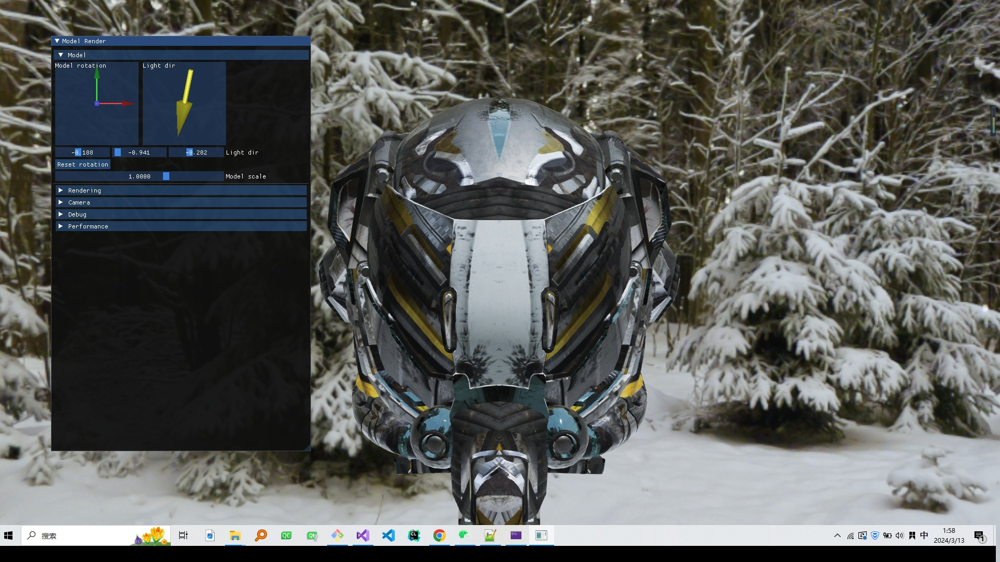
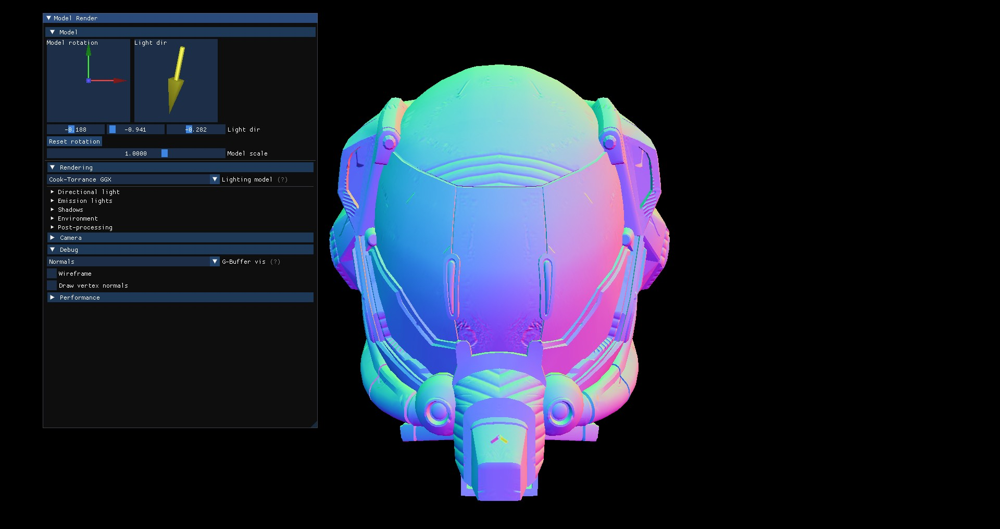
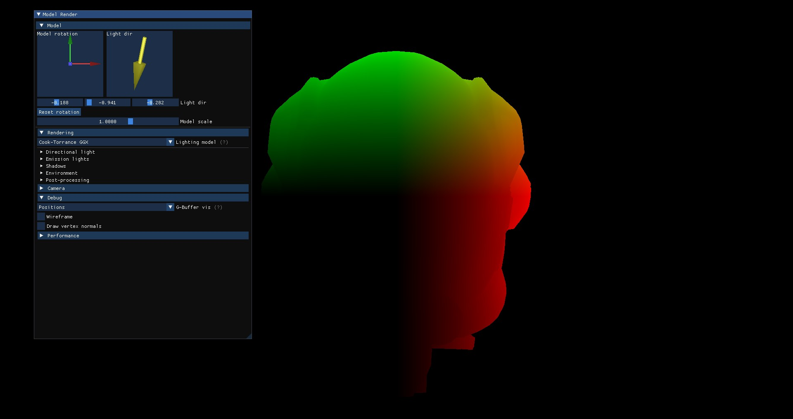

# CMERenderEngine(ComputerShader,Model,Effect)

  

Core Features
- **SkyBox**
- **Texture**
- **PBR**
- **SSAO**
- **Defer Render**

Enviroment
- Window10
- Visual Studio 2019
- GLFW GLAD
- Assimp
- Imgui
- ImguiQua

### ScreenShots

    
    

### How to Run
1: Copy `assimp-vc142-mtd.dll` in `CMERenderEngine\3dparty\dll` to `C:\Windows\System32`    
2: Run the Project In VS2019
